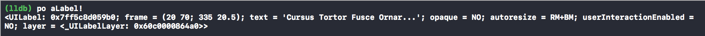
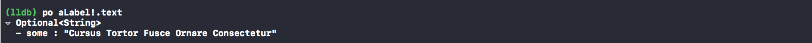
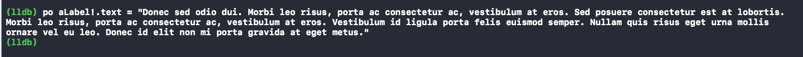
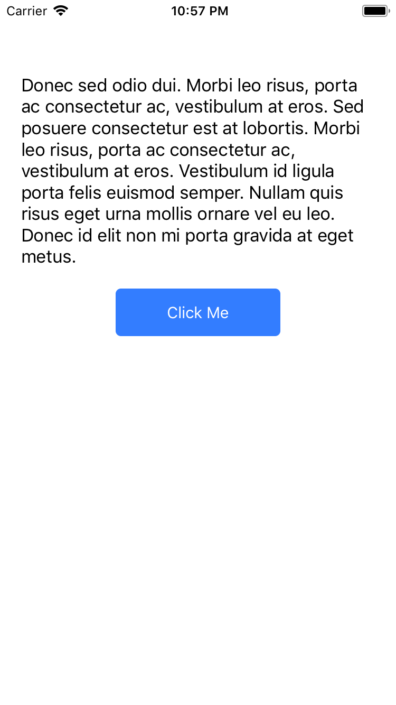
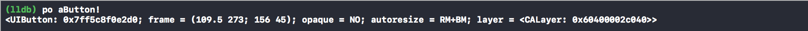
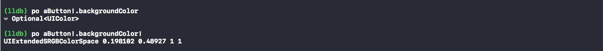
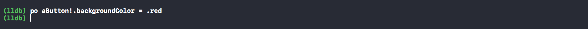
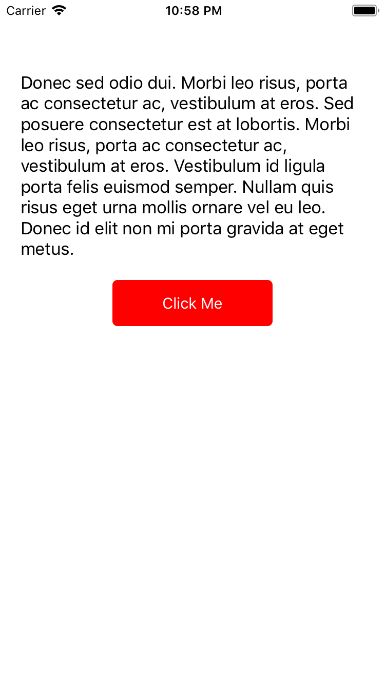

## Xcode Debugging Tips

<p>Xcode debugging is very useful feature while coding. In the number of the Xcode debugging features, there is a useful one I have recently discovered.</p>

As we know, we can easily print all variables in the debugging sesion variable list.
<hr>
For example:

```
po anArray
po aString
po evenViewObjects
```
<hr>

As I write in the examples, we can print all kind of view objects that inherited from `UIView` object. What if we should change a property of a view object. For example `text` of `UILabel`.

Let's look at what we should write for this. You can download basic project [here](https://github.com/arslanbilal/CodeExamples/tree/master/DebuggingTips) to test yourself.
<hr>

Here is the initial screen of the app, we are going to change `text` property of label(`aLabel`) and `backgroundColor` property of button(`aButton`):


This is what we see when we debug the app and print the `aLabel`:



Printing `text` property:



And changing it:



**And boom!** We have just changed the text here without re-build and re-run:



Let's print the `aButton`:



Then print the `backgroundColor` property of `aButton`:



And changing it to `redColor`:



**Boom!** We changed the background color of button from blue to red:



Here as you see, we can easily debug and change property of `UIView` object in debugging. With this, we don’t have to re-build and re-run again and again for minimal changes.